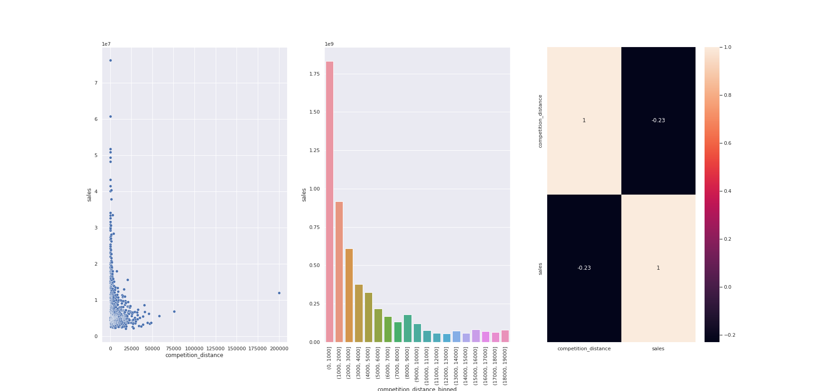
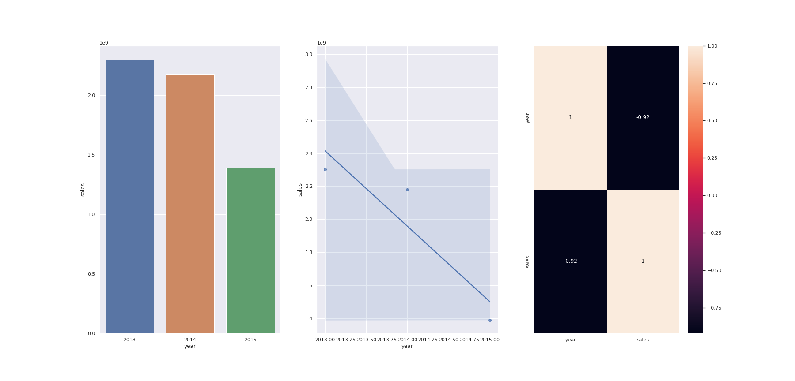
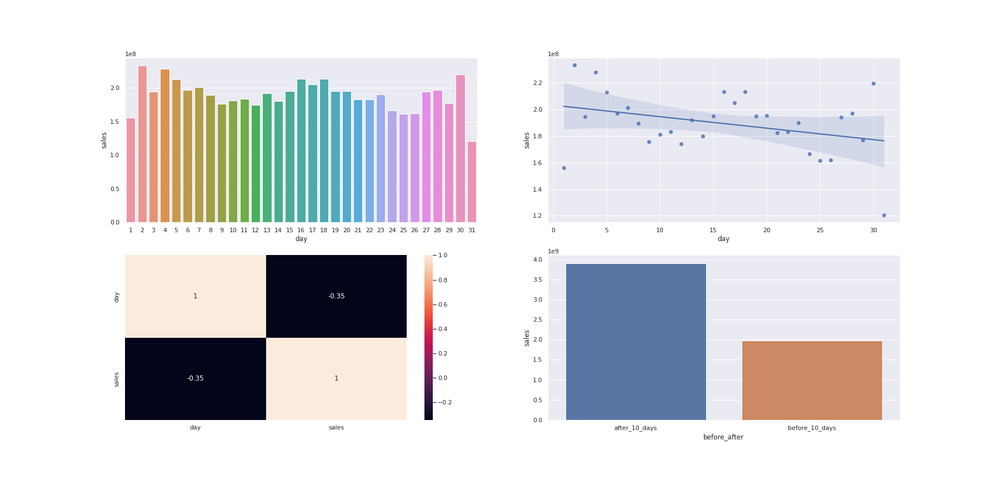

# Vendas Rossmann
**Projeto de Previsão de Vendas das Farmácias Rossmann**

Todo o cenário a seguir é completamente fictício. A empresa, o contexto, o CEO e as hipóteses de negócio foram criadas apenas para simular um ambiente real em que um ciêntista de dados está inserido.

Os dados referente a este projeto fazem parte de um desafio lançado no **kaglle**. Para acessá-los [clique aqui.](https://www.kaggle.com/c/rossmann-store-sales).  

# 1. Problema de negócio
A rede de farmácias Rossmann está presente em 7 países da Europa e possue mais de 4.000 lojas. O CFO da empresa solicitou aos seus gerentes a previsão de vendas de cada loja nas próximas seis semanas para que pudesse definir um orçamento para a reformas das lojas. Diversos fatores podem influenciar as vendas das lojas, incluindo promoções, concorrentes próximos, localização das lojas, feriados e sazonalidade.

Com milhares de gerentes prevendo as vendas com base em suas circunstâncias individuais, as previsões podem variar muito. Neste contexto, foi solicidado ao time de ciência de dados a criação de um modelo para prever as vendas das lojas com base nos dados. 

# 2. Premissas do negócio

- Lojas fechadas não nos dão informações sobre vendas, sendo assim, foram removidas de nossa análise; 
- Foram consideradas apenas lojas com vendas maiores que zero;  
- Para lojas que não possuiam informação sobre o concorrente mais próximo, concluímos que não há competição ou que não há concorrentes próximos. Neste caso, foi considerado um valor bem acima da distância observada no conjunto de dados. 

## 2.1 Descrição dos atributos

Foram fornecidas as seguintes informações de vendas para cada loja:

- **Id** - um Id que representa um (Store, Date) duplo dentro do conjunto de teste  
- **Store** - um ID único para cada loja  
- **Sales** - o volume de negócios em qualquer dia (isto é o que você está prevendo)  
- **Customers** - o número de clientes em um determinado dia  
- **Open** - um indicador para saber se a loja estava aberta: 0 = fechada, 1 = aberta  
- **StateHoliday** - indica um feriado estadual. Normalmente todas as lojas, com poucas exceções, fecham nos feriados estaduais. Observe que todas as escolas fecham nos feriados e finais de semana. a = feriado, b = feriado da Páscoa, c = Natal, 0 = Nenhum  
- **SchoolHoliday** - indica se (loja, data) foi afetado pelo fechamento de escolas públicas  
- **StoreType** - diferencia entre 4 modelos de loja diferentes: a, b, c, d  
- **Assortment** - descreve um nível de sortimento: a = básico, b = extra, c = estendido  
- **CompetitionDistance** - distância em metros até a loja concorrente mais próxima  
- **CompetitionOpenSince[Month/Year]** - fornece o ano e mês aproximados em que o concorrente mais próximo foi aberto  
- **Promo** - indica se uma loja está fazendo uma promoção naquele dia  
- **Promo2** - Promo2 é uma promoção contínua e consecutiva para algumas lojas: 0 = a loja não está participando, 1 = a loja está participando  
- **Promo2Since[Year/Week]** - descreve o ano e a semana em que a loja começou a participar da Promo2  
- **PromoInterval** - descreve os intervalos consecutivos em que a Promo2 é iniciada, nomeando os meses em que a promoção é reiniciada. Por exemplo: "Fev, maio, agosto, novembro" significa que cada rodada começa em fevereiro, maio, agosto, novembro de qualquer ano para aquela loja  

# 3. Estratégias para a solução

Para dar velocidade ao projeto e entregar valor para o negócio no menor tempo possível, foi utilidado o método cíclico CRISP-DS, aplicando os passos a seguir:

**Passo 01. Descrição dos dados:** Nesta etapa foi utilizado métodos estatísticos para descrever os dados como média, mediana, desvio padrão, máximo, mínimo, intervalo, knewness e kurtosis. Além disso foi resolvido o problema de dados faltantes levando em conta algumas questões de negócio.

**Passo 02. Engenharia de Atributos:** Neste passo, o objetivo foi criar novos atributos a partir dos atributos já existentes para descrever melhor o fenômeno a ser previsto. 

**Passo 03. Filtragem dos Dados:** Para a filtragem dos dados foi considerado que lojas fechadas não contribuem para a explicabilidade do fenômeno, uma vez que não apresentam dados de vendas. Além disso, removemos colunas que não estariam disponíveis no momento da previsão.

**Passo 04. Análise Exploratória dos Dados:** Essa é sem dúvidas a etapa mais importante do projeto. Aqui foram feitas algumas hipóteses levando em conta as variáveis preditoras juntamente com a variável a ser prevista. Nesta etapa foi gerado alguns insights, como é possível observar no tópico 4 a seguir.

**Passo 05. Preparação dos Dados:** Para adequar os dados aos modelos de apredizagem de máquina, foi feita algumas mudanças nas variáveis utilizando métodos como: Robust Scaler, One Hot Encoding, Transformação logarítmica entre outros. 

**Passo 06. Seleção de Atributos:** Nesta estapa selecionamos os melhores atributos para modelagem de máquina. 

**Passo 07. Modelagem de Aprendizado de Máquina:**

**Step 08. Ajuste Fino dos Hiperparâmetros:**

**Step 09. Conversão da Performance dos Modelos em Valores de Negócio:**

**Step 10. Implantação do Modelo em Produção:**

# 4. Top 3 insights

**HIPÓTESE 1:** Lojas com competidores mais próximos deveriam vender menos

**FALSA** Lojas com competidores mais próximos vendem MAIS

**HIPÓTESE 2:** - Lojas deveriam vender mais ao longo dos anos

**FALSO** Lojas vendem menos ao longo dos anos

**HIPÓTESE 3:** Lojas deveriam vender mais depois do dia 10 de cada mês

**VERDADEIRO** Lojas vendem mais depois do décimo dia do mês

# 5. Modelos de machine learning aplicados

- Average Model (baseline para comparação)
- Linear Regression Model
- Linear Regression Regularized Model (Lasso)
- Random Forest Regressor
- XGBoost Regressor

